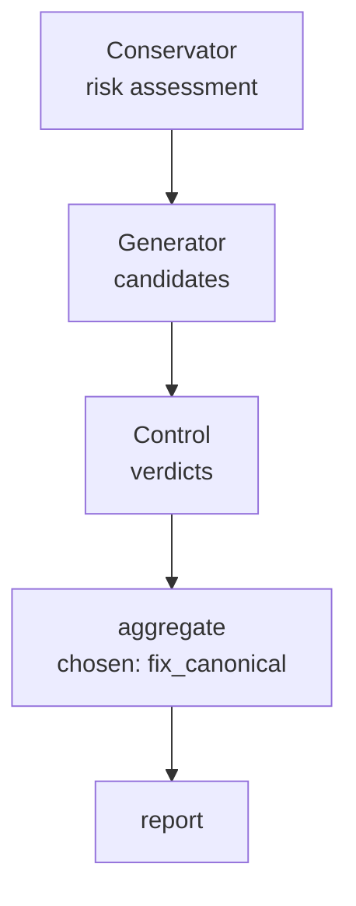

# Consilium

**A second opinion, structured.** Consilium is a [Claude Code](https://docs.claude.com/en/docs/claude-code) skill that evaluates a risky code change through three independent voices that don't trust each other — a creative, an analyst, and a skeptic — then aggregates their verdicts under a veto cascade into one canonical decision, with the disagreement preserved on disk.

One LLM reviewing its own proposal has predictable blind spots: it generates an idea and validates it from the same perspective. Consilium splits that into separate roles with disjoint mandates so a change is cross-examined before it ships.

The three core voices:

- **Conservator** (prudent) — scores risk and reversibility; runs *first* and sets the effort budget for the others
- **Generator** (creative) — proposes alternatives, including `do_nothing`
- **Control** (analytical) — verifies correctness and writes acceptance tests

## What's interesting here

- **Adversarial-by-design deliberation** — roles with conflicting incentives, not one model agreeing with itself.
- **An 8-component veto cascade** (`scripts/aggregator.py`) that turns three voice outputs into one decision with 7 distinct routing outcomes (block / rework / adapt / escalate / aggregate).
- **A self-calibrating feedback loop** — every run lands as canonical JSON in `.consilium/runs/`, outcomes are logged to `.consilium/FEEDBACK.html`, and the next deliberation reads those priors. Confidence below a per-mode floor is flagged.
- **Cost-aware modes** — from a 1× single-context pass up to a 3× three-personality vote (Trias), with a scope gate that auto-skips trivial diffs.
- **Measured, not asserted** — a benchmark harness (`benchmark/`) compares each mode against bare-model baselines on real coding/reasoning tasks with a hidden oracle.
- **Stdlib-only Python** — no external dependencies; each script is a small, standalone CLI with JSON I/O.

## Architecture explainer

An interactive, single-page walkthrough of the voices, pipeline, modes, voting, and the calibration loop is published at **[alxmax.github.io/Consilium_Demo/architecture.html](https://alxmax.github.io/Consilium_Demo/architecture.html)**. It's authored as editable React source in `docs/architecture/` (built to `docs/architecture.html`, which GitHub Pages serves) — see that folder's README to preview or rebuild it.

## When to use

- PR review or diff
- Refactor planning across 2+ files
- Choosing between multiple implementation approaches
- Before committing to shared/core code
- Risk assessment for a non-trivial change

## Install

### As a plugin (one step)

```
/plugin marketplace add alxmax/Consilium_Demo
/plugin install consilium@consilium
```

This installs the `consilium` skill plus its sub-agents in a single step. Then, in a new Claude Code session: `Review the last commit using the consilium skill`.

> **Releases:** clean, tagged releases (currently **v1.1**) are published here for installation and review.

## Example

Consilium reviews its own changes. Here's a **real run from this repo's history** — asking it to evaluate a three-bug fix. It prints one terminal line:

```
chosen: fix_canonical | conf: 0.57 | .consilium/runs/2026-05-29_2333_core-script-bugfixes.json
```

and writes a canonical JSON report to disk (string fields trimmed for length, all else verbatim):

```json
{
  "success_criterion": "aggregator raises a clear error on empty candidates; audit_counter uses the shared headless check; trace_graph exits cleanly on a missing file — run_evals stays green. …",
  "chosen_approach": "fix_canonical",
  "confidence": 0.57,
  "voice_scores": { "generator": 1.0, "control": 1.0, "conservator": 0.35 },
  "alternatives": [
    { "id": "do_nothing", "why_not": "control: three real defects persist" },
    { "id": "fix_agg_structured_null", "why_not": "control: returning null on malformed input masks the error; downstream must special-case" }
  ],
  "verification": "python scripts/run_evals.py (green); empty candidates → ValueError not IndexError; trace_graph --input missing.json → exit 2. …",
  "pipeline_executed": true
}
```

The chosen approach beat `do_nothing` and a plausible-but-weaker alternative — and the rejected options stay on record *with the reason they lost*. Confidence `0.57` is below the Sequential floor (`0.70`), so a Skeptic sub-agent auto-fires on the chosen answer before the result is trusted. Every run lands in `.consilium/runs/` (local, gitignored) and feeds the priors of the next deliberation.

## Pipeline trace

Every run records its executed path. `trace_graph.py` reads a `.consilium/runs/` report and emits a Mermaid flowchart of what actually fired — which steps ran, which short-circuited, and how sub-agents were dispatched:

```bash
python scripts/trace_graph.py --input .consilium/runs/<file>.json --fence
```

Here is the trace for the run shown above (`fix_canonical`, Sequential mode):



GitHub renders Mermaid natively — paste the `--fence` output directly into any `.md` file.

## Structure

```
consilium/
├── SKILL.md         # the contract: Constitution (4 principles) + 8-step workflow
├── .claude-plugin/  # plugin manifest + marketplace (one-step install)
├── prompts/voices/  # per-voice role prompts (generator, control, conservator, skeptic, lenses)
├── modes/           # per-mode workflow + machine-readable config (cost, sub-agents, floors)
├── scripts/         # stdlib-only CLIs: aggregator, confidence, priors, scope_gate, …
├── agents/          # consilium-subagent — isolated dispatch via the Agent tool
├── benchmark/       # mode-vs-baseline benchmark harness (oracle kept in an external sibling repo)
├── experiments/     # benchmarking-discipline notes + validation write-ups
├── docs/            # architecture.html explainer + its React source under docs/architecture/
├── evals/           # deterministic regression scenarios for the scripts
└── .consilium/      # local deliberation state (gitignored): runs/*.json + FEEDBACK.html
```

## Modes

| Mode | Cost | What it adds |
|------|------|--------------|
| **Sequential** (default) | 1× | Conservator → Generator → Control in one context |
| **Dialectic** | 1.33× | Sequential + a Skeptic sub-agent on the chosen answer, with code-context injection |
| **Trias** | 3× | 3 personalities (Pioneer / Architect / Steward), each running its own Sequential pass as a sub-agent, then a majority vote |
| **`skeptic_on_chosen`** | base +1 | Composable flag over any mode — a focal Skeptic challenges the chosen answer. Auto-triggers when `confidence ∈ [0.0, 0.7]` |

Parallel dispatch is no longer user-selectable; it remains an automatic cross-check when a change is both `critical` and `irreversible`. All dispatched voices run on Sonnet; the orchestrator runs on Opus.

**Canonical output** (validated by `scripts/validate_report.py`): JSON with `success_criterion`, `chosen_approach`, `verification`, `alternatives`, `voice_scores`, `confidence`, and a `deliberation_log`.

## Competencies demonstrated

What this project concretely shows, in Agentic-AI / LLMOps terms. Rated **Full** (named feature, runs via a documented command, artifact in-repo), **Partial** (present but not the textbook form — caveat noted), or **n/a** (deliberately out of scope).

| Capability | Status | Where / honest caveat |
|---|---|---|
| Multi-agent orchestration | Full | 3 voices + 3 Trias personalities + Skeptic, dispatched as isolated sub-agents (`agents/`, `scripts/personalities.py`) |
| Planner / executor split | Full | orchestrator selects the mode and scope-gates, then dispatches voice executors |
| Deterministic orchestration | Full | `scope_gate → voices → aggregator → validate_report → implementation pipeline`, all stdlib scripts |
| Retry / reflection / self-healing | Full | `retry_context.py` (low-confidence re-deliberation), sub-agent-crash fallback, malformed-JSON retry, red→green test gate |
| Agent execution visualization | Full | the interactive architecture explainer (`docs/architecture/`) |
| Agent memory | **Partial** | 3 tiers via `memory.py` — session context, `.consilium/runs/*.json` episodic logs, `.consilium/FEEDBACK.html` outcome journal. This is **journaling + run logs, not vector / retrieval-augmented memory** |
| Token-cost telemetry | Full (instrumentation) | per-dispatch telemetry → `efficiency.py` / `usage.py`. The explainer's tokens-per-dispatch figures are **measured** from real run telemetry; the stricter `tokens_per_OK` metric is implemented but withheld until enough runs carry a confirmed OK/BAD label |
| Regression testing | Full | `evals/scenarios.json` + `run_evals.py` — deterministic subprocess tests of the scripts (not LLM-output evals) |
| Benchmarking vs baselines | Full | `benchmark/` compares each mode against bare-model baselines with a hidden oracle kept out-of-tree |
| Fabrication / hallucination discipline | **Partial** | a documented independent-oracle rule for any quantitative claim (`experiments/README.md`) — a review process, not an automated metric |
| Version provenance | Full | every run stamps `telemetry.consilium_version` (`git describe`) + `consilium_ref` (the committed sha, blank on a dirty tree) — any `.consilium/runs/*.json` is reproducible via `git checkout`, and `scripts/version.py --drift <ref>` shows which prompts/modes changed since. Git is the version system — no bespoke registry |
| Framework orchestration (LangGraph / CrewAI) | n/a | evaluated and deliberately rejected — see below |
| RAG / embeddings / vector search · web backend · cloud deploy | n/a | out of scope by design — see below; targeted by a separate showcase project |

> **Why not LangGraph / CrewAI?** Evaluated and rejected on documented architectural grounds, not avoided — a 2026-05-16 deliberation chose `do_nothing` (confidence 0.36, conservative override), reaffirmed by two follow-ups on 2026-05-19. Three concrete integration shapes were proposed and scored:
>
> - **Full rewrite on LangGraph** — voices as `StateGraph` nodes calling the Anthropic API directly. Scored `risk=0.95`, control-invalid: it discards the orchestration substrate the skill is *built on* — Claude Code's sub-agent dispatch (the `Agent` tool, `agents/consilium-subagent.md`). Consilium's graph is small and fixed (Conservator → Generator → Control, fanning out to Trias/Skeptic sub-agents); that topology is already expressed as typed dispatch, not something a graph runtime would simplify.
> - **Vocabulary / diagrams only, no dependency** — rejected as cargo-culting: it borrows LangGraph's mental model with zero runtime benefit.
> - **Isolated post-hoc sidecar** (`experiments/langgraph_replay/` rendering `runs/*.json`) — the closest to viable, rejected because it would need a hard, fragile contract that `experiments/` is *never* imported by `scripts/`, to keep the dependency strictly off the runtime path.
>
> The deterministic glue (aggregator veto cascade, confidence, scope gate, `validate_report`) is already pure stdlib functions over JSON — independently runnable and testable as CLIs. State and resume are already file-based: every run persists as canonical JSON in `.consilium/runs/`, which *doubles* as episodic memory, the priors source, and the audit trail (globbed by `priors.py` / `usage.py` / `memory.py`). A framework checkpointer would duplicate or displace that contract; a dependency tree would add supply-chain and version surface plus indirection through the authoritative `prompts/voices/*.md` — net more surface, no new capability. The deliberations are recorded in `.consilium/runs/` (local, gitignored).

> **Why not RAG / vector memory?** The retrieval surface is small and *structured*, not a corpus: priors come from globbing `.consilium/runs/*.json` and parsing `FEEDBACK.html` — tens to low-hundreds of records — and selection is by recency, `--label` substring, and OK/BAD outcome. That lookup is exact, cheap to scan in full, and fully explainable. Embeddings + an ANN index would add a vector store and an embedding-model dependency to *approximately* match over a set small enough to read exhaustively — trading a deterministic, auditable query for a fuzzy one with no recall it couldn't already get. The precondition for RAG (a large unstructured corpus) isn't present, so it stays out of scope.

## License

[Business Source License 1.1](LICENSE) © 2026 Schipor Alexandru.

Free for non-commercial use (evaluation, education, research, personal). Commercial use within a revenue-generating organization requires a commercial license — contact the Licensor. Converts automatically to Apache 2.0 on **2030-05-16**.
