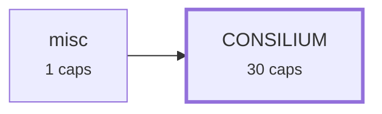

# Requirement Map

## System Map

_Capabilities grouped by area; thick border = bus; arrows = `depends_on`. Edges into the bus/hubs are hidden (the Dependency Map shows area-level coupling)._

```mermaid
graph LR
  subgraph sg_CONSILIUM["CONSILIUM"]
    CONSILIUM_AGGREGATOR_001["aggregator<br><small>CONSILIUM-AGGREGATOR-001</small>"]
    CONSILIUM_AUDIT_COUNTER_001["audit_counter<br><small>CONSILIUM-AUDIT-COUNTER-001</small>"]
    CONSILIUM_AUDIT_FEEDBACK_001["audit_feedback<br><small>CONSILIUM-AUDIT-FEEDBACK-001</small>"]
    CONSILIUM_BUILD_REPORT_001["build_report<br><small>CONSILIUM-BUILD-REPORT-001</small>"]
    CONSILIUM_CHECK_DOC_DRIFT_001["check_doc_drift<br><small>CONSILIUM-CHECK-DOC-DRIFT-001</small>"]
    CONSILIUM_CHECK_PUBLIC_LEAK_001["check_public_leak<br><small>CONSILIUM-CHECK-PUBLIC-LEAK-001</small>"]
    CONSILIUM_CONFIDENCE_001["confidence<br><small>CONSILIUM-CONFIDENCE-001</small>"]
    CONSILIUM_EFFICIENCY_001["efficiency<br><small>CONSILIUM-EFFICIENCY-001</small>"]
    CONSILIUM_FEEDBACK_001["feedback<br><small>CONSILIUM-FEEDBACK-001</small>"]
    CONSILIUM_IMPLEMENT_PIPELINE_001["implement_pipeline<br><small>CONSILIUM-IMPLEMENT-PIPELINE-001</small>"]
    CONSILIUM_INFER_PIPELINE_001["infer_pipeline<br><small>CONSILIUM-INFER-PIPELINE-001</small>"]
    CONSILIUM_LOG_FEEDBACK_001["log_feedback<br><small>CONSILIUM-LOG-FEEDBACK-001</small>"]
    CONSILIUM_MARK_OUTCOME_001["mark_outcome<br><small>CONSILIUM-MARK-OUTCOME-001</small>"]
    CONSILIUM_MEMORY_001["memory<br><small>CONSILIUM-MEMORY-001</small>"]
    CONSILIUM_PERSONALITIES_001["personalities<br><small>CONSILIUM-PERSONALITIES-001</small>"]
    CONSILIUM_PRIORS_001["priors<br><small>CONSILIUM-PRIORS-001</small>"]
    CONSILIUM_PROBE_CHANGE_001["probe_change<br><small>CONSILIUM-PROBE-CHANGE-001</small>"]
    CONSILIUM_RENDER_FEEDBACK_HTML_001["render_feedback_html<br><small>CONSILIUM-RENDER-FEEDBACK-HTML-001</small>"]
    CONSILIUM_RETRY_CONTEXT_001["retry_context<br><small>CONSILIUM-RETRY-CONTEXT-001</small>"]
    CONSILIUM_RUN_EVALS_001["run_evals<br><small>CONSILIUM-RUN-EVALS-001</small>"]
    CONSILIUM_SCOPE_GATE_001["scope_gate<br><small>CONSILIUM-SCOPE-GATE-001</small>"]
    CONSILIUM_STABILITY_CHECK_001["stability_check<br><small>CONSILIUM-STABILITY-CHECK-001</small>"]
    CONSILIUM_STRIP_CONTEXT_001["strip_context<br><small>CONSILIUM-STRIP-CONTEXT-001</small>"]
    CONSILIUM_TRACE_GRAPH_001["trace_graph<br><small>CONSILIUM-TRACE-GRAPH-001</small>"]
    CONSILIUM_USAGE_001["usage<br><small>CONSILIUM-USAGE-001</small>"]
    CONSILIUM_UTILS_001["utils<br><small>CONSILIUM-UTILS-001</small>"]
    CONSILIUM_VALIDATE_REPORT_001["validate_report<br><small>CONSILIUM-VALIDATE-REPORT-001</small>"]
    CONSILIUM_VERSION_001["version<br><small>CONSILIUM-VERSION-001</small>"]
    CONSILIUM_VOCABULARY_MAP_001["vocabulary_map<br><small>CONSILIUM-VOCABULARY-MAP-001</small>"]
    CONSILIUM_VOTE_DEGENERACY_001["vote_degeneracy<br><small>CONSILIUM-VOTE-DEGENERACY-001</small>"]
  end
  subgraph sg_misc["misc"]
    SKILL_RUN_CONSILIUM_001["run-consilium driver<br><small>SKILL-RUN-CONSILIUM-001</small>"]
  end
  CONSILIUM_AUDIT_FEEDBACK_001 --> CONSILIUM_PRIORS_001
  SKILL_RUN_CONSILIUM_001 --> CONSILIUM_AGGREGATOR_001
  SKILL_RUN_CONSILIUM_001 --> CONSILIUM_CONFIDENCE_001
  style CONSILIUM_FEEDBACK_001 stroke-width:3px
  style CONSILIUM_PERSONALITIES_001 stroke-width:3px
  style CONSILIUM_RENDER_FEEDBACK_HTML_001 stroke-width:3px
  style CONSILIUM_UTILS_001 stroke-width:3px
  style CONSILIUM_VALIDATE_REPORT_001 stroke-width:3px
  style CONSILIUM_VERSION_001 stroke-width:3px
  style CONSILIUM_VOCABULARY_MAP_001 stroke-width:3px
```

## Requirement-to-Code

_Each requirement → its code; arrow label = role (`implements` / `tested-by`). Red = confirmed but no code linked (a gap); grey = baseline/draft, not linked yet (expected)._

```mermaid
graph LR
  CONSILIUM_AGGREGATOR_001["aggregator<br><small>CONSILIUM-AGGREGATOR-001</small>"]
  f_scripts_aggregator_py_29["scripts/aggregator.py:29"]
  CONSILIUM_AGGREGATOR_001 -->|implements| f_scripts_aggregator_py_29
  CONSILIUM_AUDIT_COUNTER_001["audit_counter<br><small>CONSILIUM-AUDIT-COUNTER-001</small>"]
  f_scripts_audit_counter_py_52["scripts/audit_counter.py:52"]
  CONSILIUM_AUDIT_COUNTER_001 -->|implements| f_scripts_audit_counter_py_52
  f_scripts_test_audit_counter_py_16["scripts/test_audit_counter.py:16"]
  CONSILIUM_AUDIT_COUNTER_001 -->|tested-by| f_scripts_test_audit_counter_py_16
  CONSILIUM_AUDIT_FEEDBACK_001["audit_feedback<br><small>CONSILIUM-AUDIT-FEEDBACK-001</small>"]
  f_scripts_audit_feedback_py_29["scripts/audit_feedback.py:29"]
  CONSILIUM_AUDIT_FEEDBACK_001 -->|implements| f_scripts_audit_feedback_py_29
  CONSILIUM_BUILD_REPORT_001["build_report<br><small>CONSILIUM-BUILD-REPORT-001</small>"]
  f_scripts_build_report_py_42["scripts/build_report.py:42"]
  CONSILIUM_BUILD_REPORT_001 -->|implements| f_scripts_build_report_py_42
  CONSILIUM_CHECK_DOC_DRIFT_001["check_doc_drift<br><small>CONSILIUM-CHECK-DOC-DRIFT-001</small>"]
  f_scripts_check_doc_drift_py_25["scripts/check_doc_drift.py:25"]
  CONSILIUM_CHECK_DOC_DRIFT_001 -->|implements| f_scripts_check_doc_drift_py_25
  CONSILIUM_CHECK_PUBLIC_LEAK_001["check_public_leak<br><small>CONSILIUM-CHECK-PUBLIC-LEAK-001</small>"]
  f_scripts_check_public_leak_py_15["scripts/check_public_leak.py:15"]
  CONSILIUM_CHECK_PUBLIC_LEAK_001 -->|implements| f_scripts_check_public_leak_py_15
  CONSILIUM_CONFIDENCE_001["confidence<br><small>CONSILIUM-CONFIDENCE-001</small>"]
  f_scripts_confidence_py_57["scripts/confidence.py:57"]
  CONSILIUM_CONFIDENCE_001 -->|implements| f_scripts_confidence_py_57
  CONSILIUM_EFFICIENCY_001["efficiency<br><small>CONSILIUM-EFFICIENCY-001</small>"]
  f_scripts_efficiency_py_28["scripts/efficiency.py:28"]
  CONSILIUM_EFFICIENCY_001 -->|implements| f_scripts_efficiency_py_28
  CONSILIUM_FEEDBACK_001["feedback<br><small>CONSILIUM-FEEDBACK-001</small>"]
  f_scripts_feedback_py_12["scripts/feedback.py:12"]
  CONSILIUM_FEEDBACK_001 -->|implements| f_scripts_feedback_py_12
  CONSILIUM_IMPLEMENT_PIPELINE_001["implement_pipeline<br><small>CONSILIUM-IMPLEMENT-PIPELINE-001</small>"]
  f_scripts_implement_pipeline_py_32["scripts/implement_pipeline.py:32"]
  CONSILIUM_IMPLEMENT_PIPELINE_001 -->|implements| f_scripts_implement_pipeline_py_32
  f_scripts_test_implement_pipeline_py_6["scripts/test_implement_pipeline.py:6"]
  CONSILIUM_IMPLEMENT_PIPELINE_001 -->|tested-by| f_scripts_test_implement_pipeline_py_6
  CONSILIUM_INFER_PIPELINE_001["infer_pipeline<br><small>CONSILIUM-INFER-PIPELINE-001</small>"]
  f_scripts_infer_pipeline_py_29["scripts/infer_pipeline.py:29"]
  CONSILIUM_INFER_PIPELINE_001 -->|implements| f_scripts_infer_pipeline_py_29
  f_scripts_test_implement_mode_py_8["scripts/test_implement_mode.py:8"]
  CONSILIUM_INFER_PIPELINE_001 -->|tested-by| f_scripts_test_implement_mode_py_8
  CONSILIUM_LOG_FEEDBACK_001["log_feedback<br><small>CONSILIUM-LOG-FEEDBACK-001</small>"]
  f_scripts_log_feedback_py_41["scripts/log_feedback.py:41"]
  CONSILIUM_LOG_FEEDBACK_001 -->|implements| f_scripts_log_feedback_py_41
  CONSILIUM_MARK_OUTCOME_001["mark_outcome<br><small>CONSILIUM-MARK-OUTCOME-001</small>"]
  f_scripts_mark_outcome_py_33["scripts/mark_outcome.py:33"]
  CONSILIUM_MARK_OUTCOME_001 -->|implements| f_scripts_mark_outcome_py_33
  CONSILIUM_MEMORY_001["memory<br><small>CONSILIUM-MEMORY-001</small>"]
  f_scripts_memory_py_35["scripts/memory.py:35"]
  CONSILIUM_MEMORY_001 -->|implements| f_scripts_memory_py_35
  CONSILIUM_PERSONALITIES_001["personalities<br><small>CONSILIUM-PERSONALITIES-001</small>"]
  f_scripts_personalities_py_13["scripts/personalities.py:13"]
  CONSILIUM_PERSONALITIES_001 -->|implements| f_scripts_personalities_py_13
  f_scripts_test_lens_bias_py_31["scripts/test_lens_bias.py:31"]
  CONSILIUM_PERSONALITIES_001 -->|tested-by| f_scripts_test_lens_bias_py_31
  CONSILIUM_PRIORS_001["priors<br><small>CONSILIUM-PRIORS-001</small>"]
  f_scripts_priors_py_32["scripts/priors.py:32"]
  CONSILIUM_PRIORS_001 -->|implements| f_scripts_priors_py_32
  CONSILIUM_PROBE_CHANGE_001["probe_change<br><small>CONSILIUM-PROBE-CHANGE-001</small>"]
  f_scripts_probe_change_py_35["scripts/probe_change.py:35"]
  CONSILIUM_PROBE_CHANGE_001 -->|implements| f_scripts_probe_change_py_35
  f_scripts_test_probe_change_py_16["scripts/test_probe_change.py:16"]
  CONSILIUM_PROBE_CHANGE_001 -->|tested-by| f_scripts_test_probe_change_py_16
  CONSILIUM_RENDER_FEEDBACK_HTML_001["render_feedback_html<br><small>CONSILIUM-RENDER-FEEDBACK-HTML-001</small>"]
  f_scripts_render_feedback_html_py_11["scripts/render_feedback_html.py:11"]
  CONSILIUM_RENDER_FEEDBACK_HTML_001 -->|implements| f_scripts_render_feedback_html_py_11
  f_scripts_test_feedback_html_py_6["scripts/test_feedback_html.py:6"]
  CONSILIUM_RENDER_FEEDBACK_HTML_001 -->|tested-by| f_scripts_test_feedback_html_py_6
  CONSILIUM_RETRY_CONTEXT_001["retry_context<br><small>CONSILIUM-RETRY-CONTEXT-001</small>"]
  f_scripts_retry_context_py_48["scripts/retry_context.py:48"]
  CONSILIUM_RETRY_CONTEXT_001 -->|implements| f_scripts_retry_context_py_48
  CONSILIUM_RUN_EVALS_001["run_evals<br><small>CONSILIUM-RUN-EVALS-001</small>"]
  f_scripts_run_evals_py_23["scripts/run_evals.py:23"]
  CONSILIUM_RUN_EVALS_001 -->|implements| f_scripts_run_evals_py_23
  CONSILIUM_SCOPE_GATE_001["scope_gate<br><small>CONSILIUM-SCOPE-GATE-001</small>"]
  f_scripts_scope_gate_py_61["scripts/scope_gate.py:61"]
  CONSILIUM_SCOPE_GATE_001 -->|implements| f_scripts_scope_gate_py_61
  CONSILIUM_STABILITY_CHECK_001["stability_check<br><small>CONSILIUM-STABILITY-CHECK-001</small>"]
  f_scripts_stability_check_py_24["scripts/stability_check.py:24"]
  CONSILIUM_STABILITY_CHECK_001 -->|implements| f_scripts_stability_check_py_24
  CONSILIUM_STRIP_CONTEXT_001["strip_context<br><small>CONSILIUM-STRIP-CONTEXT-001</small>"]
  f_scripts_strip_context_py_46["scripts/strip_context.py:46"]
  CONSILIUM_STRIP_CONTEXT_001 -->|implements| f_scripts_strip_context_py_46
  CONSILIUM_TRACE_GRAPH_001["trace_graph<br><small>CONSILIUM-TRACE-GRAPH-001</small>"]
  f_scripts_trace_graph_py_20["scripts/trace_graph.py:20"]
  CONSILIUM_TRACE_GRAPH_001 -->|implements| f_scripts_trace_graph_py_20
  CONSILIUM_USAGE_001["usage<br><small>CONSILIUM-USAGE-001</small>"]
  f_scripts_usage_py_32["scripts/usage.py:32"]
  CONSILIUM_USAGE_001 -->|implements| f_scripts_usage_py_32
  CONSILIUM_UTILS_001["utils<br><small>CONSILIUM-UTILS-001</small>"]
  f_scripts_utils_py_6["scripts/utils.py:6"]
  CONSILIUM_UTILS_001 -->|implements| f_scripts_utils_py_6
  CONSILIUM_VALIDATE_REPORT_001["validate_report<br><small>CONSILIUM-VALIDATE-REPORT-001</small>"]
  f_scripts_validate_report_py_49["scripts/validate_report.py:49"]
  CONSILIUM_VALIDATE_REPORT_001 -->|implements| f_scripts_validate_report_py_49
  CONSILIUM_VERSION_001["version<br><small>CONSILIUM-VERSION-001</small>"]
  f_scripts_test_version_py_14["scripts/test_version.py:14"]
  CONSILIUM_VERSION_001 -->|tested-by| f_scripts_test_version_py_14
  f_scripts_version_py_27["scripts/version.py:27"]
  CONSILIUM_VERSION_001 -->|implements| f_scripts_version_py_27
  CONSILIUM_VOCABULARY_MAP_001["vocabulary_map<br><small>CONSILIUM-VOCABULARY-MAP-001</small>"]
  f_scripts_vocabulary_map_py_10["scripts/vocabulary_map.py:10"]
  CONSILIUM_VOCABULARY_MAP_001 -->|implements| f_scripts_vocabulary_map_py_10
  CONSILIUM_VOTE_DEGENERACY_001["vote_degeneracy<br><small>CONSILIUM-VOTE-DEGENERACY-001</small>"]
  f_scripts_test_vote_degeneracy_py_11["scripts/test_vote_degeneracy.py:11"]
  CONSILIUM_VOTE_DEGENERACY_001 -->|tested-by| f_scripts_test_vote_degeneracy_py_11
  f_scripts_vote_degeneracy_py_32["scripts/vote_degeneracy.py:32"]
  CONSILIUM_VOTE_DEGENERACY_001 -->|implements| f_scripts_vote_degeneracy_py_32
  SKILL_RUN_CONSILIUM_001["run-consilium driver<br><small>SKILL-RUN-CONSILIUM-001</small>"]
  f__claude_skills_run_consilium_driver_py_19[".claude/skills/run-consilium/driver.py:19"]
  SKILL_RUN_CONSILIUM_001 -->|implements| f__claude_skills_run_consilium_driver_py_19
```

## Dependency Map

_Area-level coupling: one box per area (N caps), arrow A->B = some capability in A depends on one in B. The System Map has the per-capability detail._

## Risk & Unknowns

_Requirements needing attention: red = unimplemented (confirmed, no code); orange = unreviewed (promote after review); yellow = blast-radius (≥3 dependents)._

```mermaid
graph LR
  subgraph sg_CONSILIUM["CONSILIUM"]
    CONSILIUM_AGGREGATOR_001["aggregator<br><small>CONSILIUM-AGGREGATOR-001</small><br>unreviewed"]
    CONSILIUM_AUDIT_COUNTER_001["audit_counter<br><small>CONSILIUM-AUDIT-COUNTER-001</small><br>unreviewed"]
    CONSILIUM_AUDIT_FEEDBACK_001["audit_feedback<br><small>CONSILIUM-AUDIT-FEEDBACK-001</small><br>unreviewed"]
    CONSILIUM_BUILD_REPORT_001["build_report<br><small>CONSILIUM-BUILD-REPORT-001</small><br>unreviewed"]
    CONSILIUM_CHECK_DOC_DRIFT_001["check_doc_drift<br><small>CONSILIUM-CHECK-DOC-DRIFT-001</small><br>unreviewed"]
    CONSILIUM_CHECK_PUBLIC_LEAK_001["check_public_leak<br><small>CONSILIUM-CHECK-PUBLIC-LEAK-001</small><br>unreviewed"]
    CONSILIUM_CONFIDENCE_001["confidence<br><small>CONSILIUM-CONFIDENCE-001</small><br>unreviewed"]
    CONSILIUM_EFFICIENCY_001["efficiency<br><small>CONSILIUM-EFFICIENCY-001</small><br>unreviewed"]
    CONSILIUM_FEEDBACK_001["feedback<br><small>CONSILIUM-FEEDBACK-001</small><br>unreviewed, blast-radius"]
    CONSILIUM_IMPLEMENT_PIPELINE_001["implement_pipeline<br><small>CONSILIUM-IMPLEMENT-PIPELINE-001</small><br>unreviewed"]
    CONSILIUM_INFER_PIPELINE_001["infer_pipeline<br><small>CONSILIUM-INFER-PIPELINE-001</small><br>unreviewed"]
    CONSILIUM_LOG_FEEDBACK_001["log_feedback<br><small>CONSILIUM-LOG-FEEDBACK-001</small><br>unreviewed"]
    CONSILIUM_MARK_OUTCOME_001["mark_outcome<br><small>CONSILIUM-MARK-OUTCOME-001</small><br>unreviewed"]
    CONSILIUM_MEMORY_001["memory<br><small>CONSILIUM-MEMORY-001</small><br>unreviewed"]
    CONSILIUM_PERSONALITIES_001["personalities<br><small>CONSILIUM-PERSONALITIES-001</small><br>unreviewed"]
    CONSILIUM_PRIORS_001["priors<br><small>CONSILIUM-PRIORS-001</small><br>unreviewed"]
    CONSILIUM_PROBE_CHANGE_001["probe_change<br><small>CONSILIUM-PROBE-CHANGE-001</small><br>unreviewed"]
    CONSILIUM_RENDER_FEEDBACK_HTML_001["render_feedback_html<br><small>CONSILIUM-RENDER-FEEDBACK-HTML-001</small><br>unreviewed, blast-radius"]
    CONSILIUM_RETRY_CONTEXT_001["retry_context<br><small>CONSILIUM-RETRY-CONTEXT-001</small><br>unreviewed"]
    CONSILIUM_RUN_EVALS_001["run_evals<br><small>CONSILIUM-RUN-EVALS-001</small><br>unreviewed"]
    CONSILIUM_SCOPE_GATE_001["scope_gate<br><small>CONSILIUM-SCOPE-GATE-001</small><br>unreviewed"]
    CONSILIUM_STABILITY_CHECK_001["stability_check<br><small>CONSILIUM-STABILITY-CHECK-001</small><br>unreviewed"]
    CONSILIUM_STRIP_CONTEXT_001["strip_context<br><small>CONSILIUM-STRIP-CONTEXT-001</small><br>unreviewed"]
    CONSILIUM_TRACE_GRAPH_001["trace_graph<br><small>CONSILIUM-TRACE-GRAPH-001</small><br>unreviewed"]
    CONSILIUM_USAGE_001["usage<br><small>CONSILIUM-USAGE-001</small><br>unreviewed"]
    CONSILIUM_UTILS_001["utils<br><small>CONSILIUM-UTILS-001</small><br>unreviewed, blast-radius"]
    CONSILIUM_VALIDATE_REPORT_001["validate_report<br><small>CONSILIUM-VALIDATE-REPORT-001</small><br>unreviewed"]
    CONSILIUM_VERSION_001["version<br><small>CONSILIUM-VERSION-001</small><br>unreviewed"]
    CONSILIUM_VOCABULARY_MAP_001["vocabulary_map<br><small>CONSILIUM-VOCABULARY-MAP-001</small><br>unreviewed"]
    CONSILIUM_VOTE_DEGENERACY_001["vote_degeneracy<br><small>CONSILIUM-VOTE-DEGENERACY-001</small><br>unreviewed"]
  end
  subgraph sg_misc["misc"]
    SKILL_RUN_CONSILIUM_001["run-consilium driver<br><small>SKILL-RUN-CONSILIUM-001</small><br>unreviewed"]
  end
  style CONSILIUM_AGGREGATOR_001 fill:#fff3cd,stroke:#a66,color:#630
  style CONSILIUM_AUDIT_COUNTER_001 fill:#fff3cd,stroke:#a66,color:#630
  style CONSILIUM_AUDIT_FEEDBACK_001 fill:#fff3cd,stroke:#a66,color:#630
  style CONSILIUM_BUILD_REPORT_001 fill:#fff3cd,stroke:#a66,color:#630
  style CONSILIUM_CHECK_DOC_DRIFT_001 fill:#fff3cd,stroke:#a66,color:#630
  style CONSILIUM_CHECK_PUBLIC_LEAK_001 fill:#fff3cd,stroke:#a66,color:#630
  style CONSILIUM_CONFIDENCE_001 fill:#fff3cd,stroke:#a66,color:#630
  style CONSILIUM_EFFICIENCY_001 fill:#fff3cd,stroke:#a66,color:#630
  style CONSILIUM_FEEDBACK_001 fill:#fff3cd,stroke:#a66,color:#630
  style CONSILIUM_IMPLEMENT_PIPELINE_001 fill:#fff3cd,stroke:#a66,color:#630
  style CONSILIUM_INFER_PIPELINE_001 fill:#fff3cd,stroke:#a66,color:#630
  style CONSILIUM_LOG_FEEDBACK_001 fill:#fff3cd,stroke:#a66,color:#630
  style CONSILIUM_MARK_OUTCOME_001 fill:#fff3cd,stroke:#a66,color:#630
  style CONSILIUM_MEMORY_001 fill:#fff3cd,stroke:#a66,color:#630
  style CONSILIUM_PERSONALITIES_001 fill:#fff3cd,stroke:#a66,color:#630
  style CONSILIUM_PRIORS_001 fill:#fff3cd,stroke:#a66,color:#630
  style CONSILIUM_PROBE_CHANGE_001 fill:#fff3cd,stroke:#a66,color:#630
  style CONSILIUM_RENDER_FEEDBACK_HTML_001 fill:#fff3cd,stroke:#a66,color:#630
  style CONSILIUM_RETRY_CONTEXT_001 fill:#fff3cd,stroke:#a66,color:#630
  style CONSILIUM_RUN_EVALS_001 fill:#fff3cd,stroke:#a66,color:#630
  style CONSILIUM_SCOPE_GATE_001 fill:#fff3cd,stroke:#a66,color:#630
  style CONSILIUM_STABILITY_CHECK_001 fill:#fff3cd,stroke:#a66,color:#630
  style CONSILIUM_STRIP_CONTEXT_001 fill:#fff3cd,stroke:#a66,color:#630
  style CONSILIUM_TRACE_GRAPH_001 fill:#fff3cd,stroke:#a66,color:#630
  style CONSILIUM_USAGE_001 fill:#fff3cd,stroke:#a66,color:#630
  style CONSILIUM_UTILS_001 fill:#fff3cd,stroke:#a66,color:#630
  style CONSILIUM_VALIDATE_REPORT_001 fill:#fff3cd,stroke:#a66,color:#630
  style CONSILIUM_VERSION_001 fill:#fff3cd,stroke:#a66,color:#630
  style CONSILIUM_VOCABULARY_MAP_001 fill:#fff3cd,stroke:#a66,color:#630
  style CONSILIUM_VOTE_DEGENERACY_001 fill:#fff3cd,stroke:#a66,color:#630
  style SKILL_RUN_CONSILIUM_001 fill:#fff3cd,stroke:#a66,color:#630
```

### Risk Table

| ID | status | members | dependents | risks | recommendation |
| --- | --- | --- | --- | --- | --- |
| CONSILIUM-AGGREGATOR-001 | baseline | 1 | 1 | unreviewed | Draft/baseline, not yet validated: review the contract, wire its `tested-by` tests, then promote to `confirmed`. Until then it is tracked, not enforced. |
| CONSILIUM-AUDIT-COUNTER-001 | baseline | 2 | 0 | unreviewed | Draft/baseline, not yet validated: review the contract, wire its `tested-by` tests, then promote to `confirmed`. Until then it is tracked, not enforced. |
| CONSILIUM-AUDIT-FEEDBACK-001 | baseline | 1 | 0 | unreviewed | Draft/baseline, not yet validated: review the contract, wire its `tested-by` tests, then promote to `confirmed`. Until then it is tracked, not enforced. |
| CONSILIUM-BUILD-REPORT-001 | baseline | 1 | 0 | unreviewed | Draft/baseline, not yet validated: review the contract, wire its `tested-by` tests, then promote to `confirmed`. Until then it is tracked, not enforced. |
| CONSILIUM-CHECK-DOC-DRIFT-001 | baseline | 1 | 0 | unreviewed | Draft/baseline, not yet validated: review the contract, wire its `tested-by` tests, then promote to `confirmed`. Until then it is tracked, not enforced. |
| CONSILIUM-CHECK-PUBLIC-LEAK-001 | baseline | 1 | 0 | unreviewed | Draft/baseline, not yet validated: review the contract, wire its `tested-by` tests, then promote to `confirmed`. Until then it is tracked, not enforced. |
| CONSILIUM-CONFIDENCE-001 | baseline | 1 | 1 | unreviewed | Draft/baseline, not yet validated: review the contract, wire its `tested-by` tests, then promote to `confirmed`. Until then it is tracked, not enforced. |
| CONSILIUM-EFFICIENCY-001 | baseline | 1 | 0 | unreviewed | Draft/baseline, not yet validated: review the contract, wire its `tested-by` tests, then promote to `confirmed`. Until then it is tracked, not enforced. |
| CONSILIUM-FEEDBACK-001 | baseline | 1 | 6 | unreviewed, blast-radius | Draft/baseline, not yet validated: review the contract, wire its `tested-by` tests, then promote to `confirmed`. Until then it is tracked, not enforced. High fan-in — many capabilities depend on this. Change it only behind its contract, run the full gate + dependents' tests, and treat it as shared foundation (bus). |
| CONSILIUM-IMPLEMENT-PIPELINE-001 | baseline | 2 | 0 | unreviewed | Draft/baseline, not yet validated: review the contract, wire its `tested-by` tests, then promote to `confirmed`. Until then it is tracked, not enforced. |
| CONSILIUM-INFER-PIPELINE-001 | baseline | 2 | 0 | unreviewed | Draft/baseline, not yet validated: review the contract, wire its `tested-by` tests, then promote to `confirmed`. Until then it is tracked, not enforced. |
| CONSILIUM-LOG-FEEDBACK-001 | baseline | 1 | 0 | unreviewed | Draft/baseline, not yet validated: review the contract, wire its `tested-by` tests, then promote to `confirmed`. Until then it is tracked, not enforced. |
| CONSILIUM-MARK-OUTCOME-001 | baseline | 1 | 0 | unreviewed | Draft/baseline, not yet validated: review the contract, wire its `tested-by` tests, then promote to `confirmed`. Until then it is tracked, not enforced. |
| CONSILIUM-MEMORY-001 | baseline | 1 | 0 | unreviewed | Draft/baseline, not yet validated: review the contract, wire its `tested-by` tests, then promote to `confirmed`. Until then it is tracked, not enforced. |
| CONSILIUM-PERSONALITIES-001 | baseline | 2 | 1 | unreviewed | Draft/baseline, not yet validated: review the contract, wire its `tested-by` tests, then promote to `confirmed`. Until then it is tracked, not enforced. |
| CONSILIUM-PRIORS-001 | baseline | 1 | 1 | unreviewed | Draft/baseline, not yet validated: review the contract, wire its `tested-by` tests, then promote to `confirmed`. Until then it is tracked, not enforced. |
| CONSILIUM-PROBE-CHANGE-001 | baseline | 2 | 0 | unreviewed | Draft/baseline, not yet validated: review the contract, wire its `tested-by` tests, then promote to `confirmed`. Until then it is tracked, not enforced. |
| CONSILIUM-RENDER-FEEDBACK-HTML-001 | baseline | 2 | 3 | unreviewed, blast-radius | Draft/baseline, not yet validated: review the contract, wire its `tested-by` tests, then promote to `confirmed`. Until then it is tracked, not enforced. High fan-in — many capabilities depend on this. Change it only behind its contract, run the full gate + dependents' tests, and treat it as shared foundation (bus). |
| CONSILIUM-RETRY-CONTEXT-001 | baseline | 1 | 0 | unreviewed | Draft/baseline, not yet validated: review the contract, wire its `tested-by` tests, then promote to `confirmed`. Until then it is tracked, not enforced. |
| CONSILIUM-RUN-EVALS-001 | baseline | 1 | 0 | unreviewed | Draft/baseline, not yet validated: review the contract, wire its `tested-by` tests, then promote to `confirmed`. Until then it is tracked, not enforced. |
| CONSILIUM-SCOPE-GATE-001 | baseline | 1 | 0 | unreviewed | Draft/baseline, not yet validated: review the contract, wire its `tested-by` tests, then promote to `confirmed`. Until then it is tracked, not enforced. |
| CONSILIUM-STABILITY-CHECK-001 | baseline | 1 | 0 | unreviewed | Draft/baseline, not yet validated: review the contract, wire its `tested-by` tests, then promote to `confirmed`. Until then it is tracked, not enforced. |
| CONSILIUM-STRIP-CONTEXT-001 | baseline | 1 | 0 | unreviewed | Draft/baseline, not yet validated: review the contract, wire its `tested-by` tests, then promote to `confirmed`. Until then it is tracked, not enforced. |
| CONSILIUM-TRACE-GRAPH-001 | baseline | 1 | 0 | unreviewed | Draft/baseline, not yet validated: review the contract, wire its `tested-by` tests, then promote to `confirmed`. Until then it is tracked, not enforced. |
| CONSILIUM-USAGE-001 | baseline | 1 | 0 | unreviewed | Draft/baseline, not yet validated: review the contract, wire its `tested-by` tests, then promote to `confirmed`. Until then it is tracked, not enforced. |
| CONSILIUM-UTILS-001 | baseline | 1 | 21 | unreviewed, blast-radius | Draft/baseline, not yet validated: review the contract, wire its `tested-by` tests, then promote to `confirmed`. Until then it is tracked, not enforced. High fan-in — many capabilities depend on this. Change it only behind its contract, run the full gate + dependents' tests, and treat it as shared foundation (bus). |
| CONSILIUM-VALIDATE-REPORT-001 | baseline | 1 | 1 | unreviewed | Draft/baseline, not yet validated: review the contract, wire its `tested-by` tests, then promote to `confirmed`. Until then it is tracked, not enforced. |
| CONSILIUM-VERSION-001 | baseline | 2 | 1 | unreviewed | Draft/baseline, not yet validated: review the contract, wire its `tested-by` tests, then promote to `confirmed`. Until then it is tracked, not enforced. |
| CONSILIUM-VOCABULARY-MAP-001 | baseline | 1 | 0 | unreviewed | Draft/baseline, not yet validated: review the contract, wire its `tested-by` tests, then promote to `confirmed`. Until then it is tracked, not enforced. |
| CONSILIUM-VOTE-DEGENERACY-001 | baseline | 2 | 0 | unreviewed | Draft/baseline, not yet validated: review the contract, wire its `tested-by` tests, then promote to `confirmed`. Until then it is tracked, not enforced. |
| SKILL-RUN-CONSILIUM-001 | baseline | 1 | 0 | unreviewed | Draft/baseline, not yet validated: review the contract, wire its `tested-by` tests, then promote to `confirmed`. Until then it is tracked, not enforced. |
