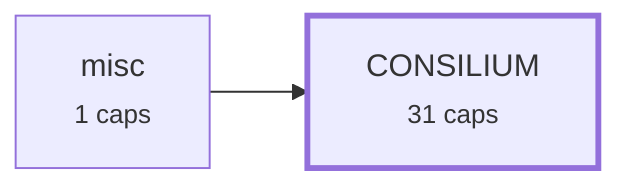

# Requirement Map

## System Map

_Capabilities grouped by area; thick border = bus; arrows = `depends_on`. Edges into the bus/hubs are hidden (the Dependency Map shows area-level coupling)._

```mermaid
graph LR
  subgraph sg_CONSILIUM["CONSILIUM"]
    CONSILIUM_AGGREGATOR_001["aggregator<br><small>CONSILIUM-AGGREGATOR-001</small>"]
    CONSILIUM_BUILD_REPORT_001["build_report<br><small>CONSILIUM-BUILD-REPORT-001</small>"]
    CONSILIUM_CHECK_DOC_DRIFT_001["check_doc_drift<br><small>CONSILIUM-CHECK-DOC-DRIFT-001</small>"]
    CONSILIUM_CHECK_PUBLIC_LEAK_001["check_public_leak<br><small>CONSILIUM-CHECK-PUBLIC-LEAK-001</small>"]
    CONSILIUM_CONFIDENCE_001["confidence<br><small>CONSILIUM-CONFIDENCE-001</small>"]
    CONSILIUM_FEEDBACK_001["feedback<br><small>CONSILIUM-FEEDBACK-001</small>"]
    CONSILIUM_IMPLEMENT_PIPELINE_001["implement_pipeline<br><small>CONSILIUM-IMPLEMENT-PIPELINE-001</small>"]
    CONSILIUM_LENS_ARCHITECT_001["architect lens<br><small>CONSILIUM-LENS-ARCHITECT-001</small>"]
    CONSILIUM_LENS_PIONEER_001["pioneer lens<br><small>CONSILIUM-LENS-PIONEER-001</small>"]
    CONSILIUM_LENS_STEWARD_001["steward lens<br><small>CONSILIUM-LENS-STEWARD-001</small>"]
    CONSILIUM_LOG_FEEDBACK_001["log_feedback<br><small>CONSILIUM-LOG-FEEDBACK-001</small>"]
    CONSILIUM_MARK_OUTCOME_001["mark_outcome<br><small>CONSILIUM-MARK-OUTCOME-001</small>"]
    CONSILIUM_MEMORY_001["memory<br><small>CONSILIUM-MEMORY-001</small>"]
    CONSILIUM_MODE_DIALECTIC_001["dialectic mode<br><small>CONSILIUM-MODE-DIALECTIC-001</small>"]
    CONSILIUM_MODE_SEQUENTIAL_001["sequential mode<br><small>CONSILIUM-MODE-SEQUENTIAL-001</small>"]
    CONSILIUM_MODE_SKEPTIC_ON_CHOSEN_001["skeptic_on_chosen flag<br><small>CONSILIUM-MODE-SKEPTIC-ON-CHOSEN-001</small>"]
    CONSILIUM_MODE_TRIAS_001["trias mode<br><small>CONSILIUM-MODE-TRIAS-001</small>"]
    CONSILIUM_PERSONALITIES_001["personalities<br><small>CONSILIUM-PERSONALITIES-001</small>"]
    CONSILIUM_PRIORS_001["priors<br><small>CONSILIUM-PRIORS-001</small>"]
    CONSILIUM_RENDER_FEEDBACK_HTML_001["render_feedback_html<br><small>CONSILIUM-RENDER-FEEDBACK-HTML-001</small>"]
    CONSILIUM_RETRY_CONTEXT_001["retry_context<br><small>CONSILIUM-RETRY-CONTEXT-001</small>"]
    CONSILIUM_RUN_EVALS_001["run_evals<br><small>CONSILIUM-RUN-EVALS-001</small>"]
    CONSILIUM_SCOPE_GATE_001["scope_gate<br><small>CONSILIUM-SCOPE-GATE-001</small>"]
    CONSILIUM_STRIP_CONTEXT_001["strip_context<br><small>CONSILIUM-STRIP-CONTEXT-001</small>"]
    CONSILIUM_UTILS_001["utils<br><small>CONSILIUM-UTILS-001</small>"]
    CONSILIUM_VALIDATE_REPORT_001["validate_report<br><small>CONSILIUM-VALIDATE-REPORT-001</small>"]
    CONSILIUM_VOCABULARY_MAP_001["vocabulary_map<br><small>CONSILIUM-VOCABULARY-MAP-001</small>"]
    CONSILIUM_VOICE_CONSERVATOR_001["conservator voice<br><small>CONSILIUM-VOICE-CONSERVATOR-001</small>"]
    CONSILIUM_VOICE_CONTROL_001["control voice<br><small>CONSILIUM-VOICE-CONTROL-001</small>"]
    CONSILIUM_VOICE_GENERATOR_001["generator voice<br><small>CONSILIUM-VOICE-GENERATOR-001</small>"]
    CONSILIUM_VOICE_SKEPTIC_001["skeptic voice<br><small>CONSILIUM-VOICE-SKEPTIC-001</small>"]
  end
  subgraph sg_misc["misc"]
    SKILL_RUN_CONSILIUM_001["run-consilium driver<br><small>SKILL-RUN-CONSILIUM-001</small>"]
  end
  CONSILIUM_MODE_DIALECTIC_001 --> CONSILIUM_MODE_SEQUENTIAL_001
  CONSILIUM_MODE_DIALECTIC_001 --> CONSILIUM_VOICE_SKEPTIC_001
  CONSILIUM_MODE_SEQUENTIAL_001 --> CONSILIUM_VOICE_GENERATOR_001
  CONSILIUM_MODE_SEQUENTIAL_001 --> CONSILIUM_VOICE_CONTROL_001
  CONSILIUM_MODE_SEQUENTIAL_001 --> CONSILIUM_VOICE_CONSERVATOR_001
  CONSILIUM_MODE_SEQUENTIAL_001 --> CONSILIUM_AGGREGATOR_001
  CONSILIUM_MODE_SKEPTIC_ON_CHOSEN_001 --> CONSILIUM_VOICE_SKEPTIC_001
  CONSILIUM_MODE_TRIAS_001 --> CONSILIUM_MODE_SEQUENTIAL_001
  CONSILIUM_MODE_TRIAS_001 --> CONSILIUM_LENS_PIONEER_001
  CONSILIUM_MODE_TRIAS_001 --> CONSILIUM_LENS_ARCHITECT_001
  CONSILIUM_MODE_TRIAS_001 --> CONSILIUM_LENS_STEWARD_001
  SKILL_RUN_CONSILIUM_001 --> CONSILIUM_AGGREGATOR_001
  SKILL_RUN_CONSILIUM_001 --> CONSILIUM_CONFIDENCE_001
  style CONSILIUM_FEEDBACK_001 stroke-width:3px
  style CONSILIUM_PERSONALITIES_001 stroke-width:3px
  style CONSILIUM_RENDER_FEEDBACK_HTML_001 stroke-width:3px
  style CONSILIUM_UTILS_001 stroke-width:3px
  style CONSILIUM_VALIDATE_REPORT_001 stroke-width:3px
  style CONSILIUM_VOCABULARY_MAP_001 stroke-width:3px
```

## Requirement-to-Code

_Each requirement → its code; arrow label = role (`implements` / `tested-by`). Red = confirmed but no code linked (a gap); grey = baseline/draft, not linked yet (expected)._

```mermaid
graph LR
  CONSILIUM_AGGREGATOR_001["aggregator<br><small>CONSILIUM-AGGREGATOR-001</small>"]
  f_scripts_aggregator_py_29["scripts/aggregator.py:29"]
  CONSILIUM_AGGREGATOR_001 -->|implements| f_scripts_aggregator_py_29
  f_scripts_test_round2_py_7["scripts/test_round2.py:7"]
  CONSILIUM_AGGREGATOR_001 -->|tested-by| f_scripts_test_round2_py_7
  CONSILIUM_BUILD_REPORT_001["build_report<br><small>CONSILIUM-BUILD-REPORT-001</small>"]
  f_scripts_build_report_py_42["scripts/build_report.py:42"]
  CONSILIUM_BUILD_REPORT_001 -->|implements| f_scripts_build_report_py_42
  f_scripts_test_build_report_py_11["scripts/test_build_report.py:11"]
  CONSILIUM_BUILD_REPORT_001 -->|tested-by| f_scripts_test_build_report_py_11
  CONSILIUM_CHECK_DOC_DRIFT_001["check_doc_drift<br><small>CONSILIUM-CHECK-DOC-DRIFT-001</small>"]
  f_scripts_check_doc_drift_py_25["scripts/check_doc_drift.py:25"]
  CONSILIUM_CHECK_DOC_DRIFT_001 -->|implements| f_scripts_check_doc_drift_py_25
  CONSILIUM_CHECK_PUBLIC_LEAK_001["check_public_leak<br><small>CONSILIUM-CHECK-PUBLIC-LEAK-001</small>"]
  f_scripts_check_public_leak_py_15["scripts/check_public_leak.py:15"]
  CONSILIUM_CHECK_PUBLIC_LEAK_001 -->|implements| f_scripts_check_public_leak_py_15
  CONSILIUM_CONFIDENCE_001["confidence<br><small>CONSILIUM-CONFIDENCE-001</small>"]
  f_scripts_confidence_py_57["scripts/confidence.py:57"]
  CONSILIUM_CONFIDENCE_001 -->|implements| f_scripts_confidence_py_57
  f_scripts_test_confidence_py_11["scripts/test_confidence.py:11"]
  CONSILIUM_CONFIDENCE_001 -->|tested-by| f_scripts_test_confidence_py_11
  CONSILIUM_FEEDBACK_001["feedback<br><small>CONSILIUM-FEEDBACK-001</small>"]
  f_scripts_feedback_py_12["scripts/feedback.py:12"]
  CONSILIUM_FEEDBACK_001 -->|implements| f_scripts_feedback_py_12
  CONSILIUM_IMPLEMENT_PIPELINE_001["implement_pipeline<br><small>CONSILIUM-IMPLEMENT-PIPELINE-001</small>"]
  f_scripts_implement_pipeline_py_32["scripts/implement_pipeline.py:32"]
  CONSILIUM_IMPLEMENT_PIPELINE_001 -->|implements| f_scripts_implement_pipeline_py_32
  f_scripts_test_implement_pipeline_py_6["scripts/test_implement_pipeline.py:6"]
  CONSILIUM_IMPLEMENT_PIPELINE_001 -->|tested-by| f_scripts_test_implement_pipeline_py_6
  CONSILIUM_LENS_ARCHITECT_001["architect lens<br><small>CONSILIUM-LENS-ARCHITECT-001</small>"]
  f_prompts_voices_architect_lens_md_25["prompts/voices/architect_lens.md:25"]
  CONSILIUM_LENS_ARCHITECT_001 -->|implements| f_prompts_voices_architect_lens_md_25
  CONSILIUM_LENS_PIONEER_001["pioneer lens<br><small>CONSILIUM-LENS-PIONEER-001</small>"]
  f_prompts_voices_pioneer_lens_md_25["prompts/voices/pioneer_lens.md:25"]
  CONSILIUM_LENS_PIONEER_001 -->|implements| f_prompts_voices_pioneer_lens_md_25
  CONSILIUM_LENS_STEWARD_001["steward lens<br><small>CONSILIUM-LENS-STEWARD-001</small>"]
  f_prompts_voices_steward_lens_md_25["prompts/voices/steward_lens.md:25"]
  CONSILIUM_LENS_STEWARD_001 -->|implements| f_prompts_voices_steward_lens_md_25
  CONSILIUM_LOG_FEEDBACK_001["log_feedback<br><small>CONSILIUM-LOG-FEEDBACK-001</small>"]
  f_scripts_log_feedback_py_41["scripts/log_feedback.py:41"]
  CONSILIUM_LOG_FEEDBACK_001 -->|implements| f_scripts_log_feedback_py_41
  f_scripts_test_log_feedback_py_10["scripts/test_log_feedback.py:10"]
  CONSILIUM_LOG_FEEDBACK_001 -->|tested-by| f_scripts_test_log_feedback_py_10
  CONSILIUM_MARK_OUTCOME_001["mark_outcome<br><small>CONSILIUM-MARK-OUTCOME-001</small>"]
  f_scripts_mark_outcome_py_33["scripts/mark_outcome.py:33"]
  CONSILIUM_MARK_OUTCOME_001 -->|implements| f_scripts_mark_outcome_py_33
  CONSILIUM_MEMORY_001["memory<br><small>CONSILIUM-MEMORY-001</small>"]
  f_scripts_memory_py_35["scripts/memory.py:35"]
  CONSILIUM_MEMORY_001 -->|implements| f_scripts_memory_py_35
  CONSILIUM_MODE_DIALECTIC_001["dialectic mode<br><small>CONSILIUM-MODE-DIALECTIC-001</small>"]
  f_modes_dialectic_md_47["modes/dialectic.md:47"]
  CONSILIUM_MODE_DIALECTIC_001 -->|implements| f_modes_dialectic_md_47
  CONSILIUM_MODE_SEQUENTIAL_001["sequential mode<br><small>CONSILIUM-MODE-SEQUENTIAL-001</small>"]
  f_modes_sequential_md_67["modes/sequential.md:67"]
  CONSILIUM_MODE_SEQUENTIAL_001 -->|implements| f_modes_sequential_md_67
  CONSILIUM_MODE_SKEPTIC_ON_CHOSEN_001["skeptic_on_chosen flag<br><small>CONSILIUM-MODE-SKEPTIC-ON-CHOSEN-001</small>"]
  f_modes_skeptic_on_chosen_md_68["modes/skeptic_on_chosen.md:68"]
  CONSILIUM_MODE_SKEPTIC_ON_CHOSEN_001 -->|implements| f_modes_skeptic_on_chosen_md_68
  CONSILIUM_MODE_TRIAS_001["trias mode<br><small>CONSILIUM-MODE-TRIAS-001</small>"]
  f_modes_trias_md_174["modes/trias.md:174"]
  CONSILIUM_MODE_TRIAS_001 -->|implements| f_modes_trias_md_174
  CONSILIUM_PERSONALITIES_001["personalities<br><small>CONSILIUM-PERSONALITIES-001</small>"]
  f_scripts_personalities_py_13["scripts/personalities.py:13"]
  CONSILIUM_PERSONALITIES_001 -->|implements| f_scripts_personalities_py_13
  f_scripts_test_lens_bias_py_31["scripts/test_lens_bias.py:31"]
  CONSILIUM_PERSONALITIES_001 -->|tested-by| f_scripts_test_lens_bias_py_31
  CONSILIUM_PRIORS_001["priors<br><small>CONSILIUM-PRIORS-001</small>"]
  f_scripts_priors_py_32["scripts/priors.py:32"]
  CONSILIUM_PRIORS_001 -->|implements| f_scripts_priors_py_32
  f_scripts_test_priors_py_10["scripts/test_priors.py:10"]
  CONSILIUM_PRIORS_001 -->|tested-by| f_scripts_test_priors_py_10
  CONSILIUM_RENDER_FEEDBACK_HTML_001["render_feedback_html<br><small>CONSILIUM-RENDER-FEEDBACK-HTML-001</small>"]
  f_scripts_render_feedback_html_py_11["scripts/render_feedback_html.py:11"]
  CONSILIUM_RENDER_FEEDBACK_HTML_001 -->|implements| f_scripts_render_feedback_html_py_11
  f_scripts_test_feedback_html_py_6["scripts/test_feedback_html.py:6"]
  CONSILIUM_RENDER_FEEDBACK_HTML_001 -->|tested-by| f_scripts_test_feedback_html_py_6
  CONSILIUM_RETRY_CONTEXT_001["retry_context<br><small>CONSILIUM-RETRY-CONTEXT-001</small>"]
  f_scripts_retry_context_py_48["scripts/retry_context.py:48"]
  CONSILIUM_RETRY_CONTEXT_001 -->|implements| f_scripts_retry_context_py_48
  f_scripts_test_retry_context_py_11["scripts/test_retry_context.py:11"]
  CONSILIUM_RETRY_CONTEXT_001 -->|tested-by| f_scripts_test_retry_context_py_11
  CONSILIUM_RUN_EVALS_001["run_evals<br><small>CONSILIUM-RUN-EVALS-001</small>"]
  f_scripts_run_evals_py_23["scripts/run_evals.py:23"]
  CONSILIUM_RUN_EVALS_001 -->|implements| f_scripts_run_evals_py_23
  CONSILIUM_SCOPE_GATE_001["scope_gate<br><small>CONSILIUM-SCOPE-GATE-001</small>"]
  f_scripts_scope_gate_py_61["scripts/scope_gate.py:61"]
  CONSILIUM_SCOPE_GATE_001 -->|implements| f_scripts_scope_gate_py_61
  f_scripts_test_scope_gate_py_11["scripts/test_scope_gate.py:11"]
  CONSILIUM_SCOPE_GATE_001 -->|tested-by| f_scripts_test_scope_gate_py_11
  CONSILIUM_STRIP_CONTEXT_001["strip_context<br><small>CONSILIUM-STRIP-CONTEXT-001</small>"]
  f_scripts_strip_context_py_46["scripts/strip_context.py:46"]
  CONSILIUM_STRIP_CONTEXT_001 -->|implements| f_scripts_strip_context_py_46
  f_scripts_test_strip_context_py_10["scripts/test_strip_context.py:10"]
  CONSILIUM_STRIP_CONTEXT_001 -->|tested-by| f_scripts_test_strip_context_py_10
  CONSILIUM_UTILS_001["utils<br><small>CONSILIUM-UTILS-001</small>"]
  f_scripts_test_utils_py_10["scripts/test_utils.py:10"]
  CONSILIUM_UTILS_001 -->|tested-by| f_scripts_test_utils_py_10
  f_scripts_utils_py_6["scripts/utils.py:6"]
  CONSILIUM_UTILS_001 -->|implements| f_scripts_utils_py_6
  CONSILIUM_VALIDATE_REPORT_001["validate_report<br><small>CONSILIUM-VALIDATE-REPORT-001</small>"]
  f_scripts_test_round2_py_8["scripts/test_round2.py:8"]
  CONSILIUM_VALIDATE_REPORT_001 -->|tested-by| f_scripts_test_round2_py_8
  f_scripts_validate_report_py_49["scripts/validate_report.py:49"]
  CONSILIUM_VALIDATE_REPORT_001 -->|implements| f_scripts_validate_report_py_49
  CONSILIUM_VOCABULARY_MAP_001["vocabulary_map<br><small>CONSILIUM-VOCABULARY-MAP-001</small>"]
  f_scripts_test_round2_py_9["scripts/test_round2.py:9"]
  CONSILIUM_VOCABULARY_MAP_001 -->|tested-by| f_scripts_test_round2_py_9
  f_scripts_vocabulary_map_py_10["scripts/vocabulary_map.py:10"]
  CONSILIUM_VOCABULARY_MAP_001 -->|implements| f_scripts_vocabulary_map_py_10
  CONSILIUM_VOICE_CONSERVATOR_001["conservator voice<br><small>CONSILIUM-VOICE-CONSERVATOR-001</small>"]
  f_prompts_voices_conservator_md_198["prompts/voices/conservator.md:198"]
  CONSILIUM_VOICE_CONSERVATOR_001 -->|implements| f_prompts_voices_conservator_md_198
  CONSILIUM_VOICE_CONTROL_001["control voice<br><small>CONSILIUM-VOICE-CONTROL-001</small>"]
  f_prompts_voices_control_md_113["prompts/voices/control.md:113"]
  CONSILIUM_VOICE_CONTROL_001 -->|implements| f_prompts_voices_control_md_113
  CONSILIUM_VOICE_GENERATOR_001["generator voice<br><small>CONSILIUM-VOICE-GENERATOR-001</small>"]
  f_prompts_voices_generator_md_134["prompts/voices/generator.md:134"]
  CONSILIUM_VOICE_GENERATOR_001 -->|implements| f_prompts_voices_generator_md_134
  CONSILIUM_VOICE_SKEPTIC_001["skeptic voice<br><small>CONSILIUM-VOICE-SKEPTIC-001</small>"]
  f_prompts_voices_skeptic_md_123["prompts/voices/skeptic.md:123"]
  CONSILIUM_VOICE_SKEPTIC_001 -->|implements| f_prompts_voices_skeptic_md_123
  SKILL_RUN_CONSILIUM_001["run-consilium driver<br><small>SKILL-RUN-CONSILIUM-001</small>"]
  f__claude_skills_run_consilium_driver_py_19[".claude/skills/run-consilium/driver.py:19"]
  SKILL_RUN_CONSILIUM_001 -->|implements| f__claude_skills_run_consilium_driver_py_19
```

## Dependency Map

_Area-level coupling: one box per area (N caps), arrow A->B = some capability in A depends on one in B. The System Map has the per-capability detail._

## Risk & Unknowns

_Requirements needing attention: red = unimplemented (confirmed, no code); orange = unreviewed (promote after review); yellow = untested (implemented but no tested-by — set `test_exempt` to silence), or unverified-intent (open verify-intent question)._

